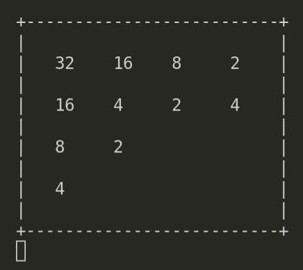

# rusty-lc3-vm

A simple LC3 VM to practice Rust.

The [Little Computer 3](https://en.wikipedia.org/wiki/Little_Computer_3) 
is a fictional computer used to teach students about assembly language. 

## Run

`cargo run -- test_img/2048.obj`

## References

- [justinmeiners LC3](https://justinmeiners.github.io/lc3-vm/)
- [LC3 ISA](https://justinmeiners.github.io/lc3-vm/supplies/lc3-isa.pdf)
- source for test images in [test_img/](test_img/)
  - [lc3-2048](https://github.com/rpendleton/lc3-2048)
  - [lc3-rogue](https://github.com/justinmeiners/lc3-rogue)
